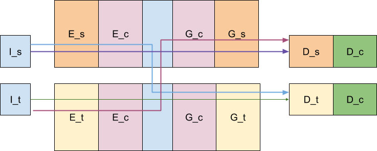
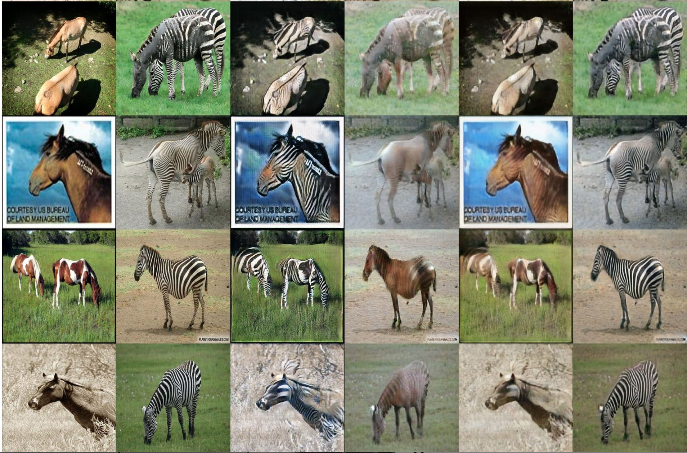
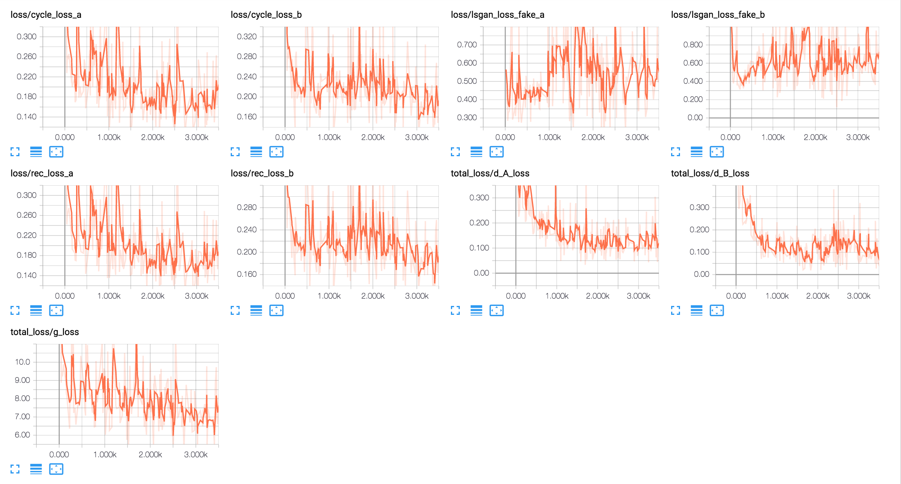

# Unsupervised Image to Image Translation Networks
This is the TensorFlow Implementation of the NIPS 2017 paper ["Unsupervised Image to Image Translation Networks"](https://arxiv.org/abs/1703.00848) by [Harry Yang](http://www.harryyang.org). 



**Disclaimer**: This was our own research project but it shares the same idea with the paper so we are making the code publicly available.

## Introduction

In particular, we tried the 'pix2pix' model which is the auto-encoder model described in the paper, and also the 'resnet' model made up of 9 blocks of resnet (middle blocks are shared). We found that the 'resnet' model gives better result than auto-encoder and (slightly) better results than CycleGAN.

Below is a snapshot of our result at the 44th epoch using 'resnet' model with default parameters on the horse-zebra dataset. From left to right is: real horse, real zebra, fake zebra, fake horse, cycle horse, cycle zebra.



## Getting Started
### Prepare dataset

Download horse-zebra dataset (or any other dataset) and create a csv file containing the paths of image pairs in the dataset. 
-Download an image dataset (e.g. horse-zebra) and unzip:
```bash
bash ./download_datasets.sh horse2zebra
```
-Create csv files
```bash
python -m dataset.create_single_domain_filelist --input_path=path/to/horse/train --output_file=/data/img2img/horse.csv
python -m dataset.create_single_domain_filelist --input_path=path/to/zebra/train --output_file=/data/img2img/zebra.csv
python -m dataset.create_image_pair_list --first_dataset=/data/img2img/horse.csv --second_dataset=/data/img2img/zebra.csv --output_file=/data/img2img/horse_zebra.csv
```
* Modify config.py based on the location of the csv file (the trained models will also be saved in the folder).

### Train CycleGAN

* Use resnet model with default parameters:
```
python -m main --split_name='horse_zebra' --cycle_lambda=15 --rec_lambda=1 --num_separate_layers_g=2 --num_separate_layers_d=5 --num_no_skip_layers=0 --lsgan_lambda_a=1 --lsgan_lambda_b=1 --network_structure='resnet'
```
* Use autoencoder model with default parameters:
```
python -m main --split_name='horse_zebra' --cycle_lambda=30 --rec_lambda=10 --num_separate_layers_g=3 --num_separate_layers_d=5 --num_no_skip_layers=0 --lsgan_lambda_a=2 --lsgan_lambda_b=2
```

### Restore from previous checkpoints
```
python -m main --split_name='horse_zebra' --cycle_lambda=15 --rec_lambda=1 --num_separate_layers_g=2 --num_separate_layers_d=5 --num_no_skip_layers=0 --lsgan_lambda_a=1 --lsgan_lambda_b=1 --network_structure='resnet' --checkpoint_dir=path/to/saved/checkpoint
```

### TensorBoard Output



### Visualization
Each epoch saves an html file for better visualization.